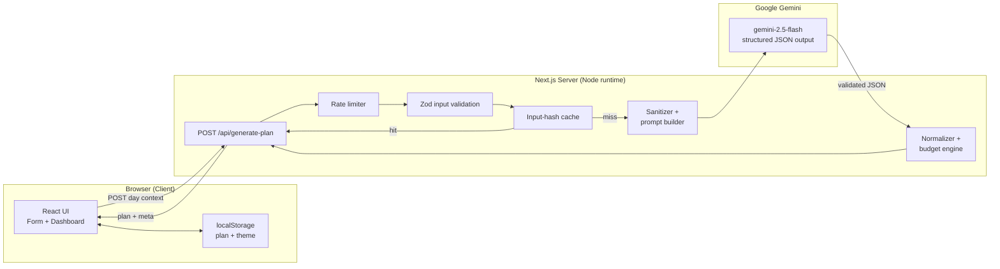

# 🍳 CookFlow — Your day, turned into a cooking plan

> Tell CookFlow about your day, budget, and diet. It returns a **timed cooking to‑do list**, recipes for each meal, a grocery list grouped by aisle, money‑saving ingredient swaps, and a real budget check — generated end‑to‑end by **Google Gemini**.

<p align="left">
  
  
  
  
  
</p>

---

## 📖 Project Description

**What it does.** CookFlow turns a few simple inputs (wake/dinner time, which meals to plan, servings, budget, dietary needs, what's in your pantry, and your skill level) into a practical, structured cooking plan for the day: a short recipe for each meal, a time‑ordered cooking checklist, a grocery list grouped by category, smart substitutions to save money, and an authoritative budget check.

**Why it exists.** "What should I cook today, and can I afford it?" is a daily, low‑glamour problem. Generic recipe sites ignore your budget and schedule, and generic chatbots hand back untimed walls of text with made‑up prices. CookFlow was built for **Google PromptWars** to fix that: it uses Gemini to plan like a practical home cook, then **re‑computes the budget on the server** so the numbers actually hold up.

Everything runs on **real Gemini responses** — no mock data, no hardcoded recipes.

> ℹ️ **Repository layout:** this repo hosts two PromptWars projects. **CookFlow** is the app at the repository **root** (documented here). A second project, **LocaleLore**, lives in the [`localelore/`](./localelore) subdirectory with its own [README](./localelore/README.md).

---

## ✨ Features

- **Timed cooking to‑do list** — a chronological, checkable checklist with a live progress ring so nothing goes cold.
- **Recipes per meal** — breakfast/lunch/dinner cards with steps, prep time, and estimated cost.
- **Grocery list by aisle** — items grouped by category (produce, protein, dairy, grains, pantry, spices) with a one‑tap copy‑to‑clipboard.
- **Smart swaps** — cheaper/healthier ingredient substitutions with the reason and the money saved.
- **Authoritative budgeting** — the total is **recomputed on the server** from the grocery list, and the plan is auto‑revised to fit when it goes over (AI math is never trusted).
- **Download PDF** — export the whole plan as a clean, multi‑page PDF (jsPDF, lazy‑loaded on demand).
- **Engaging loading state** — rotating health‑ and food‑minded "thoughts" with kitchen icons keep the screen alive while Gemini works.
- **Dietary aware** — vegetarian, vegan, gluten‑free, high‑protein and more, plus an "ingredients to avoid" list.
- **Polished, accessible UX** — Material‑inspired design with a cohesive icon set, dark mode, skeleton loaders, empty/error/success states, WAI‑ARIA tabs, keyboard navigation, and WCAG‑AA contrast.

---

## 🧱 Tech Stack

| Layer      | Choice                                        |
| ---------- | --------------------------------------------- |
| Framework  | **Next.js 15** (App Router)                   |
| Language   | **TypeScript** (strict)                       |
| Styling    | **Tailwind CSS** (CSS‑variable theming)       |
| Icons      | Hand‑built, dependency‑free **SVG icon set**  |
| AI         | **Google Gemini** via `@google/generative-ai` |
| Validation | **Zod** (input + AI output)                   |
| PDF export | **jsPDF** (lazy‑loaded on demand)             |
| Testing    | **Vitest** + Testing Library                  |
| Hosting    | **Vercel**                                    |

---

## 🚀 Installation Instructions

### Prerequisites
- **Node.js 18.18+** (developed on Node 22)
- A **Google Gemini API key** — free from [Google AI Studio](https://aistudio.google.com/apikey)

### Setup

```bash
# 1. Clone the repository
git clone https://github.com/TanuShree952838/LocaleLore.git
cd LocaleLore            # CookFlow is the project at the repo root

# 2. Install dependencies
npm install

# 3. Configure environment variables
cp .env.example .env.local
#    then open .env.local and add your GEMINI_API_KEY

# 4. Start the dev server
npm run dev
#    → http://localhost:3000
```

Prefer a different port? `npm run dev -- -p 3006`.

---

## 🕹️ Usage

### Using the app
1. Open the app in your browser.
2. Choose **which meals** to plan and enter your **wake/dinner time, servings, budget, and dietary needs**.
3. Optionally add **what's in your pantry** so CookFlow plans around it to save money.
4. Click **Generate my cooking plan** — Gemini builds the plan in a few seconds.
5. Explore the tabs: **Meals**, **To‑Do**, **Grocery**, and **Swaps**. Your last plan is saved locally and restored on refresh.
6. **Copy** the grocery list to your clipboard, or **Download PDF** to take the whole plan offline.

### Key scripts

```bash
npm run dev          # Start the dev server (http://localhost:3000)
npm run build        # Production build (also type-checks)
npm run start        # Serve the production build
npm run lint         # ESLint (no-console, no unused, etc.)
npm run typecheck    # Strict TypeScript, no emit
npm test             # Run all 55 Vitest tests
npm run test:watch   # Run tests in watch mode
```

---

## 🖼️ Examples / Demos

### Example: generate a plan via the API

The browser never talks to Gemini directly — it calls the app's own server route:

```bash
curl -X POST http://localhost:3000/api/generate-plan \
  -H "Content-Type: application/json" \
  -d '{
    "wakeTime": "07:00",
    "dinnerTime": "20:00",
    "scheduleNote": "Busy work day, short lunch break",
    "includeMeals": ["breakfast", "lunch", "dinner"],
    "servings": 2,
    "budget": 800,
    "currency": "INR",
    "dietary": ["vegetarian", "high-protein"],
    "avoid": "mushrooms",
    "pantry": "rice, onions, tomatoes, eggs",
    "skill": "beginner"
  }'
```

A successful response returns a validated, normalized plan plus metadata:

```jsonc
{
  "plan": {
    "summary": "...",
    "meals":         [ /* per-meal recipe, steps, prep time, cost */ ],
    "tasks":         [ /* time-ordered cooking checklist */ ],
    "grocery":       [ /* items with quantity, category, cost */ ],
    "substitutions": [ /* cheaper/healthier swaps + savings */ ],
    "budget": { "status": "within_budget", "estimatedTotal": 740, "remaining": 60 }
  },
  "meta": { "model": "gemini-2.5-flash", "cached": false, "revised": false }
}
```

---

## 🏗️ Architecture

The browser never calls Gemini directly. All AI calls go through a single server route that validates, sanitizes, rate‑limits, caches, and recomputes the budget math.



**How Gemini is used:** each generation makes a real Gemini call configured with a native `responseSchema` (structured JSON output) so the model returns exactly the shape we need. Two reliability details matter:

- **Thinking is disabled** (`thinkingConfig.thinkingBudget: 0`). On `gemini-2.5-flash`, "thinking" tokens are drawn from the same output budget and were truncating the JSON; turning them off makes responses **complete and ~2× faster**.
- **Model fallback chain** — `gemini-2.5-flash` → `gemini-2.5-flash-lite`, with a single **self‑repair retry** if the JSON fails Zod validation.

The response is `JSON.parse`d and validated with Zod, timeouts/rate‑limits/upstream errors map to typed error codes, and the server **recomputes the budget** so the AI's arithmetic is never trusted.

---

## 🔑 Environment Variables

Create `.env.local` from `.env.example`:

| Variable                | Required | Default            | Description                                                   |
| ----------------------- | -------- | ------------------ | ------------------------------------------------------------- |
| `GEMINI_API_KEY`        | ✅       | —                  | Server‑only Gemini key. **Never** prefix with `NEXT_PUBLIC_`. |
| `GEMINI_MODEL`          | ❌       | `gemini-2.5-flash` | Override the primary Gemini model.                            |
| `RATE_LIMIT_MAX`        | ❌       | `10`               | Requests allowed per IP inside the rate‑limit window.         |
| `RATE_LIMIT_WINDOW_MS`  | ❌       | `60000`            | Rate‑limit window in milliseconds (60000 = 1 minute).         |

---

## 🧪 Testing

```bash
npm test          # run all 55 tests (Vitest)
npm run typecheck # strict TypeScript
npm run lint      # ESLint
```

Coverage spans input & AI‑output validation, sanitization / prompt‑injection defense, budget math & normalization, the rate limiter, the cache, the full API route (happy path, cache hit, and error mapping), and the form component.

---

## ☁️ Deployment (Vercel)

CookFlow deploys from the **repository root** (LocaleLore is a separate Vercel project pointing at `localelore/`).

1. Push the repo to GitHub.
2. Import it in Vercel and leave the **Root Directory** as the repo root (`.`).
3. Add the environment variable `GEMINI_API_KEY` (Production + Preview).
4. Deploy — the **Next.js** preset is auto‑detected; no extra config. The plan API is allowed up to 60s (`maxDuration`), which fits the Vercel Hobby plan.
5. Smoke‑test the live URL by generating a plan a couple of times.

---

## 📄 License

Released under the **MIT License** — see [`LICENSE`](./LICENSE). You're free to use, modify, and distribute this project with attribution.

---

## 👩‍💻 Contributors / Contact

**Developed by Tanushree Sharma**

- 💼 LinkedIn: [tanushree-sharma](https://www.linkedin.com/in/tanushree--sharma/)
- 🐙 GitHub: [@TanuShree952838](https://github.com/TanuShree952838)

Questions, feedback, or ideas? Open an [issue](https://github.com/TanuShree952838/LocaleLore/issues) or reach out on LinkedIn.

---

<sub>CookFlow · AI cooking to‑do list · Powered by Google Gemini. Plans are AI‑generated — please double‑check quantities, prices, and dietary needs before you cook.</sub>
