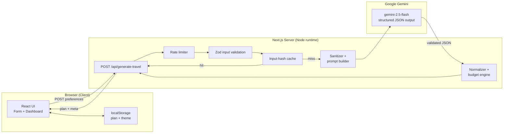

# 🧭 LocaleLore — Travel like a local

> Tell us where you're going and pick a local guide. LocaleLore gives you a **day‑by‑day trip plan** — the best places to visit, where to eat, walking routes, local crafts, and the stories behind each spot — generated end‑to‑end by **Google Gemini**.

<p align="left">
  
  
  
  
  
</p>

---

## 📖 Project Description

**What it does.** LocaleLore turns a few simple inputs (destination, dates, budget, interests, and a local guide persona) into a structured, practical travel plan: a day‑by‑day timeline, curated sights and hidden gems, authentic food spots, a walkable route, local crafts, cultural etiquette, and the folklore behind each place.

**Why it exists.** Most travel tools funnel everyone to the same crowded, heavily‑marketed spots, and generic AI chatbots reply with sterile guidebook text, made‑up closures, and budgets that don't add up. LocaleLore was built for **Google PromptWars** to fix that: it uses Gemini to plan *like a local friend would*, then re‑checks the AI's numbers on the server so the plan actually holds up in the real world.

Everything runs on **real Gemini responses** — no mock data, no hardcoded attractions, no fake AI.

> ℹ️ **Repository layout:** the LocaleLore application lives in the [`localelore/`](./localelore) subdirectory. All commands below assume you `cd localelore` first.

---

## ✨ Features

- **Pick a local guide** — choose a persona (history, food, or crafts) and the plan is narrated in their voice.
- **Day‑by‑day timeline** — a checkable morning‑to‑evening itinerary with durations and costs.
- **Sights & hidden gems** — each with the reason it was chosen, cultural/historical context, best time to visit, and photo spots.
- **Where to eat** — authentic local food picks with etiquette and tips.
- **Walking route** — a custom, animated SVG route map (no heavy map libraries).
- **Myths & folklore** — the stories that give a place its character.
- **Trust & transparency** — every recommendation shows *"Why I chose this"*, and an AI‑provenance panel explains how the plan was generated.
- **Authoritative budgeting** — totals are recomputed on the server and the plan is auto‑revised to fit when it goes over budget (AI math is never trusted).
- **Engaging loading state** — rotating status lines and icons keep the screen alive while Gemini works.
- **Polished, accessible UX** — Material‑inspired design, dark mode, skeleton loaders, empty/error/success states, WAI‑ARIA tabs, keyboard navigation, and WCAG‑AA contrast.

---

## 🧱 Tech Stack

| Layer      | Choice                                        |
| ---------- | --------------------------------------------- |
| Framework  | **Next.js 15** (App Router)                   |
| Language   | **TypeScript** (strict)                       |
| Styling    | **Tailwind CSS** (CSS‑variable theming)       |
| Icons      | **lucide-react**                              |
| AI         | **Google Gemini** via `@google/generative-ai` |
| Validation | **Zod** (input + AI output)                   |
| Testing    | **Vitest** + Testing Library                  |
| Hosting    | **Vercel**                                    |

---

## 🚀 Installation Instructions

### Prerequisites
- **Node.js 18.18+** (developed on Node 22)
- A **Google Gemini API key** — free from [Google AI Studio](https://aistudio.google.com/apikey)

### Setup

```bash
# 1. Clone the repository
git clone https://github.com/TanuShree952838/LocaleLore.git
cd LocaleLore/localelore

# 2. Install dependencies
npm install

# 3. Configure environment variables
cp .env.example .env.local
#    then open .env.local and add your GEMINI_API_KEY

# 4. Start the dev server
npm run dev
#    → http://localhost:3000
```

Prefer a different port? `npm run dev -- -p 3005`.

---

## 🕹️ Usage

### Using the app
1. Open the app in your browser.
2. Fill in your **destination, dates, budget, and interests**.
3. **Pick a local guide** persona.
4. Click **Create my travel plan** — Gemini builds a day‑by‑day plan.
5. Explore the tabs: **Timeline**, **Sights & crafts**, **Walking route**, and **Flavors & customs**. Your last plan is saved locally and restored on refresh.

### Key scripts

Run these from inside the `localelore/` directory:

```bash
npm run dev          # Start the dev server (http://localhost:3000)
npm run build        # Production build (also type-checks)
npm run start        # Serve the production build
npm run lint         # ESLint (no-console, no unused, etc.)
npm run typecheck    # Strict TypeScript, no emit
npm test             # Run all 50 Vitest tests
npm run test:watch   # Run tests in watch mode
```

---

## 🖼️ Examples / Demos

### Example: generate a plan via the API

The browser never talks to Gemini directly — it calls the app's own server route:

```bash
curl -X POST http://localhost:3000/api/generate-travel \
  -H "Content-Type: application/json" \
  -d '{
    "destination": "Kyoto, Japan",
    "days": 2,
    "budget": 200,
    "currency": "USD",
    "interests": ["history", "food"],
    "residentGuide": "historian"
  }'
```

A successful response returns a validated, normalized plan plus metadata:

```jsonc
{
  "plan": {
    "summary": "...",
    "timeline": [ /* day-by-day slots with times, costs, and notes */ ],
    "attractions": [ /* sights with "whySelected", best time, photo spots */ ],
    "walkingRoute": [ /* ordered waypoints for the SVG map */ ],
    "budget": { "total": 186, "status": "within_budget", "remaining": 14 }
  },
  "meta": { "model": "gemini-2.5-flash", "cached": false, "revised": false }
}
```

### Demo walkthrough
1. **Pick a guide** → e.g. *the history guide* for folklore and old‑town routes.
2. **Query a city** (e.g. Kyoto) → get opinionated local picks, not tourist traps.
3. **Open any card** → read *"Why I chose this"* and the cultural context.
4. **Check the budget** → the server has already re‑summed costs and flagged if it's over.

> 📸 *Tip: add screenshots or a short GIF of the dashboard here to make the README pop.*

---

## 🏗️ Architecture

The browser never calls Gemini directly. All AI calls go through a single server route that validates, sanitizes, rate‑limits, caches, and recomputes the budget math.



**How Gemini is used:** one real Gemini call per generation with a `system` instruction (persona + rules + prompt‑injection defenses) and JSON output. The response is `JSON.parse`d and validated with Zod; on malformed output there's **one self‑repair retry** before failing. Timeouts, rate limits, and upstream errors map to typed error codes, and the server recomputes the budget so the AI's arithmetic is never trusted.

---

## 🔑 Environment Variables

Create `localelore/.env.local` from `.env.example`:

| Variable                | Required | Default            | Description                                                          |
| ----------------------- | -------- | ------------------ | -------------------------------------------------------------------- |
| `GEMINI_API_KEY`        | ✅       | —                  | Server‑only Gemini key. **Never** prefix with `NEXT_PUBLIC_`.        |
| `GEMINI_MODEL`          | ❌       | `gemini-2.5-flash` | Override the Gemini model.                                           |
| `RATE_LIMIT_MAX`        | ❌       | `10`               | Requests allowed per IP inside the rate‑limit window.               |
| `RATE_LIMIT_WINDOW_MS`  | ❌       | `60000`            | Rate‑limit window in milliseconds (60000 = 1 minute).               |

---

## 🧪 Testing

```bash
npm test          # run all 50 tests (Vitest)
npm run typecheck # strict TypeScript
npm run lint      # ESLint
```

Coverage spans input & AI‑output validation, sanitization / prompt‑injection defense, budget math & normalization, the rate limiter, the cache, the full API route (happy path, cache hit, and error mapping), and the form component.

---

## ☁️ Deployment (Vercel)

1. Push the repo to GitHub.
2. Import it in Vercel and set the **root directory** to `localelore/`.
3. Add the environment variable `GEMINI_API_KEY` (Production + Preview).
4. Deploy — the **Next.js** preset is auto‑detected; no extra config.
5. Smoke‑test the live URL by generating a plan a couple of times.

---

## 📄 License

Released under the **MIT License** — see [`LICENSE`](./LICENSE). You're free to use, modify, and distribute this project with attribution.

---

## 👩‍💻 Contributors / Contact

**Developed by Tanushree Sharma**

- 💼 LinkedIn: [tanushree-sharma](https://www.linkedin.com/in/tanushree--sharma/)
- 🐙 GitHub: [@TanuShree952838](https://github.com/TanuShree952838)

Questions, feedback, or ideas? Open an [issue](https://github.com/TanuShree952838/LocaleLore/issues) or reach out on LinkedIn.

---

<sub>LocaleLore · Travel like a local · Powered by Google Gemini. Plans are AI‑generated — please double‑check opening hours, prices, and local rules before you go.</sub>
