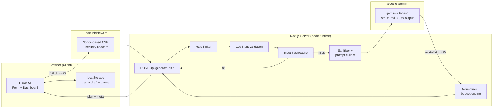
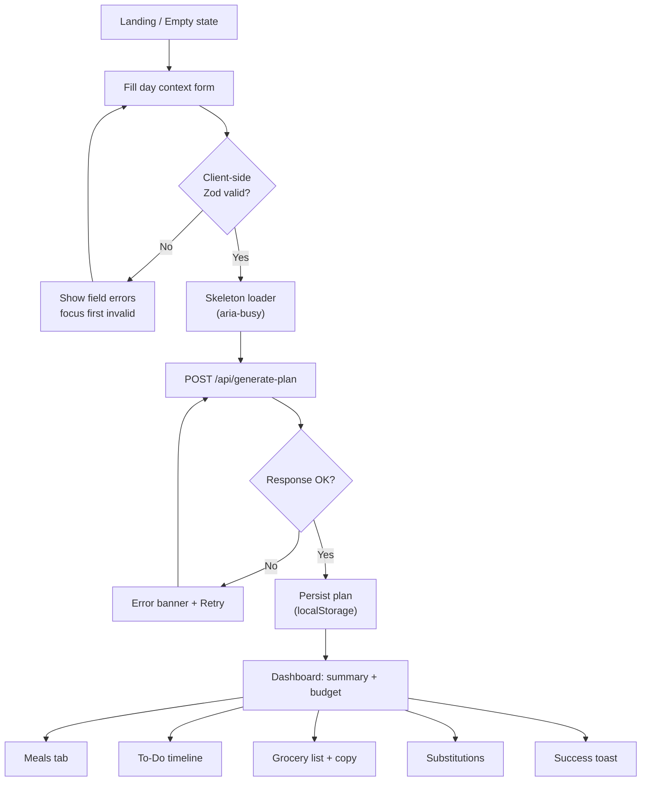
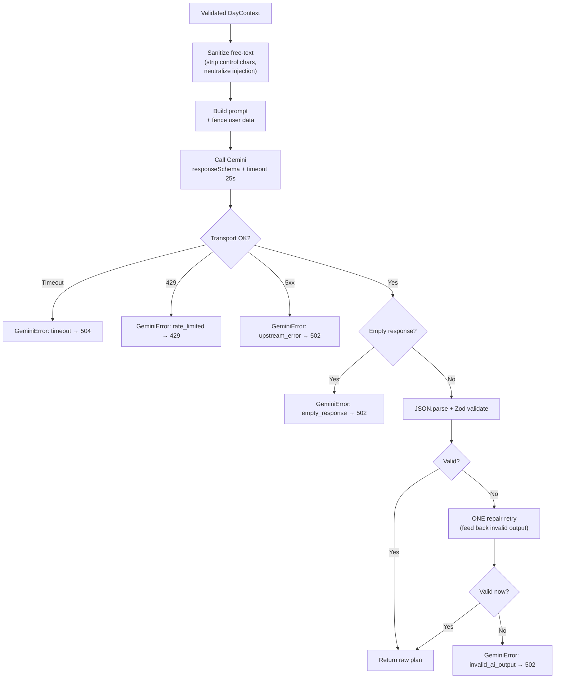
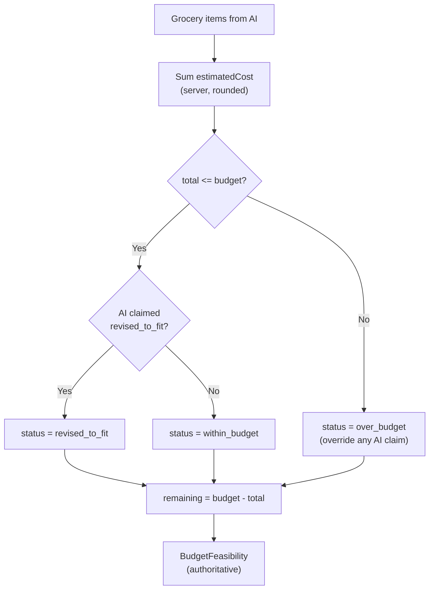
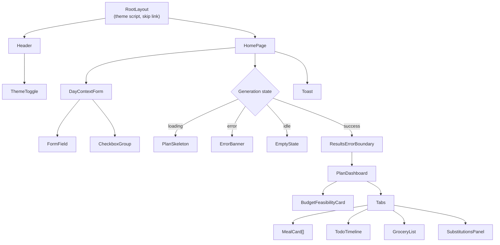
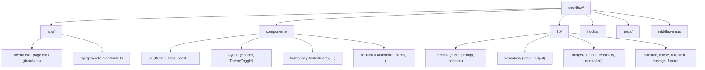
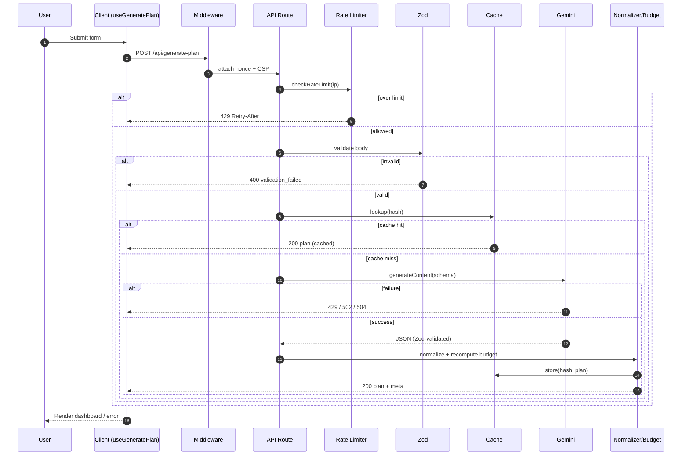

# 🍳 CookFlow — AI Cooking To-Do List

> Turn your day into an actionable cooking plan: **timed tasks**, a **consolidated grocery list**, **smart substitutions**, and a **real budget check** — generated by **Google Gemini**.

CookFlow is a focused AI micro-app built for **Google PromptWars**. Instead of dumping recipes, it answers the questions people actually get stuck on: *What do I cook today? When do I start? What do I buy? What do I swap? Can I afford it?*

Everything runs **end-to-end with real Gemini responses** — no mock data, no hardcoded meals, no fake AI.

---

## ✨ Features

- **Structured meal planning** for Breakfast / Lunch / Dinner (plan only the meals you want).
- **Timed cooking to-do list** — an interactive, checkable timeline from morning prep to dinner.
- **Consolidated grocery list** grouped by aisle, with estimated costs and one-tap copy.
- **Smart substitutions** with concrete reasons (cost, availability, dietary) and savings.
- **Authoritative budget feasibility** — totals are recomputed on the server, never trusted from the model; the plan is revised to fit when over budget.
- **Real Gemini integration** with native structured output, schema validation, a self-repair retry, timeout, and rate-limit handling.
- **Production hardening** — strict nonce-based CSP, input sanitization, prompt-injection defense, in-memory rate limiting and caching.
- **Polished UX** — responsive layout, dark mode (no flash), skeleton loaders, empty/error/success states, toasts.
- **Accessible** — semantic HTML, ARIA tab pattern, keyboard navigation, focus management, WCAG-AA contrast.
- **Fully tested** — 55 unit / integration / API / validation / edge-case tests.

---

## 🧱 Tech Stack

| Layer | Choice |
|---|---|
| Framework | **Next.js 15** (App Router) |
| Language | **TypeScript** (strict) |
| Styling | **Tailwind CSS** (CSS-variable theming) |
| AI | **Google Gemini** via `@google/generative-ai` |
| Validation | **Zod** (input + AI output) |
| Testing | **Vitest** + Testing Library |
| Hosting | **Vercel** |

---

## 🏗️ Architecture

The browser never talks to Gemini directly. All AI calls go through a single server route that validates, sanitizes, rate-limits, caches, and recomputes budget math.



---

## 🔄 Application Flow



---

## 🤖 Gemini Request Flow



---

## 💰 Budget Decision Flow

The model proposes prices; **the server decides feasibility.** AI arithmetic is never trusted.



---

## 🧩 Component Hierarchy



---

## 📁 Folder Structure



Actual layout:

```text
cookflow/
├── app/
│   ├── api/generate-plan/route.ts   # single AI endpoint
│   ├── layout.tsx                   # metadata, theme no-flash, skip link
│   ├── page.tsx                     # form ↔ results orchestration
│   └── globals.css                  # theme tokens (light/dark)
├── components/
│   ├── ui/                          # Button, Badge, Tabs, Skeleton, Toast, ...
│   ├── layout/                      # Header, ThemeToggle
│   ├── form/                        # DayContextForm, FormField, CheckboxGroup
│   └── results/                     # PlanDashboard, MealCard, TodoTimeline, ...
├── hooks/                           # useGeneratePlan, useTheme
├── lib/
│   ├── gemini/                      # client (real API), prompt, schema
│   ├── validation/                  # input + output Zod schemas
│   ├── budget/ + plan/              # feasibility math, normalizer
│   ├── sanitize.ts cache.ts rate-limit.ts storage.ts format.ts types.ts cn.ts
├── tests/                           # 55 tests (unit/integration/api/edge)
├── middleware.ts                    # nonce-based CSP + security headers
├── next.config.mjs  tailwind.config.ts  tsconfig.json  vitest.config.ts
└── .env.example
```

---

## 🔁 API Sequence Diagram



---

## 🚀 Getting Started

### Prerequisites
- Node.js 18.18+ (developed on Node 22/26)
- A Google Gemini API key — free from [Google AI Studio](https://aistudio.google.com/apikey)

### Installation

```bash
git clone <your-repo-url> cookflow
cd cookflow
npm install
cp .env.example .env.local   # then add your key
npm run dev                  # http://localhost:3000
```

### Environment Variables

| Variable | Required | Default | Description |
|---|---|---|---|
| `GEMINI_API_KEY` | ✅ | — | Server-only Gemini key. **Never** prefix with `NEXT_PUBLIC_`. |
| `GEMINI_MODEL` | ❌ | `gemini-2.0-flash` | Override the model. |
| `RATE_LIMIT_MAX` | ❌ | `10` | Requests per IP per window. |
| `RATE_LIMIT_WINDOW_MS` | ❌ | `60000` | Rate-limit window (ms). |

---

## 🧠 How AI Is Used

CookFlow uses **one real Gemini call per generation** (`gemini-2.0-flash`) with **native structured output** (`responseSchema`), so the model returns strict JSON that maps directly to the app's types. Gemini performs the cross-constraint reasoning that rule-based templates can't do well:

- balancing **schedule + skill + servings** into realistic, time-blocked tasks,
- **consolidating** ingredients across meals into one deduplicated grocery list,
- proposing **substitutions** with human-readable reasoning,
- **revising** the plan to fit the budget.

Reliability & safety layers around the call:
- **Structured output + Zod** double-validation,
- **one self-repair retry** on malformed output,
- **25s timeout**, typed **rate-limit / timeout / upstream** handling,
- **prompt-injection defense** (sanitization + fenced, labelled user data),
- **server-side budget recomputation** so AI math is never trusted.

---

## 🔐 Security

- **API key** lives server-side only; the browser calls our own origin (`connect-src 'self'`).
- **Strict nonce-based CSP** (`strict-dynamic`, no `unsafe-inline` scripts) generated per request in `middleware.ts`, plus `X-Frame-Options`, `X-Content-Type-Options`, `Referrer-Policy`, `Permissions-Policy`.
- **Input validation** with Zod on both client and server, with length caps to prevent abuse.
- **Prompt-injection defense**: control-char stripping, fence neutralization, and instruction wrapping.
- **XSS**: all AI output is rendered as text via React escaping (no `dangerouslySetInnerHTML` for content).
- **Rate limiting** per IP to protect the endpoint and quota.

---

## ♿ Accessibility

- Semantic landmarks (`header`, `main`, `form`, `fieldset`/`legend`, `section`).
- **Keyboard-first**: skip link, visible focus rings, full WAI-ARIA **tabs** pattern (Arrow/Home/End, roving tabindex).
- Labels linked to inputs; errors announced via `role="alert"` and `aria-describedby`.
- Live regions for loading (`aria-busy`, polite status) and success (`role="status"`).
- WCAG-AA color contrast in both light and dark themes; respects `prefers-reduced-motion`.

---

## ⚡ Performance

- **One** AI call per generation; identical requests served from an **input-hash cache**.
- In-flight requests are **aborted** when superseded (no duplicate calls).
- **Skeleton** loaders for perceived performance; localStorage restore avoids re-generation on refresh.
- Lean bundle (~123 kB first load JS), no heavy chart/asset dependencies, system font stack (zero font downloads).

---

## 🧪 Testing

```bash
npm test          # run all 55 tests
npm run test:watch
npm run typecheck # strict TS, no emit
npm run lint      # ESLint (no-console, no unused, etc.)
```

Coverage spans: input & AI-output validation, sanitization / prompt injection, budget math & normalization, rate limiter, cache, the full API route (happy path, cache hit, 400/429/500/502/504 mapping), and the form component (render, valid submit, validation error, disabled state).

---

## ☁️ Deployment (Vercel)

1. Push this repo to GitHub.
2. Import it in [Vercel](https://vercel.com/new).
3. Add environment variable `GEMINI_API_KEY` (Production + Preview).
4. Deploy. Framework preset **Next.js** is auto-detected; no extra config.
5. Smoke-test the production URL (generate a plan 2–3×).

### Deployment checklist
- [ ] `GEMINI_API_KEY` set in Vercel (not in the client bundle)
- [ ] Production build passes (`npm run build`)
- [ ] Generate plan works on the live URL
- [ ] Budget total matches the grocery sum
- [ ] Error state verified (temporarily unset key or use airplane mode)
- [ ] Lighthouse: Accessibility & Best Practices ≥ 90
- [ ] Dark + light modes verified

---

## 🔮 Future Improvements

- Weekly planning with **leftover chaining** (dinner → next-day lunch).
- Live regional **price feeds** for exact costs.
- **Gemini Vision**: photograph your pantry to auto-detect ingredients.
- Household **shared lists** and calendar sync.
- Distributed rate limiting / caching (Upstash Redis) for multi-region scale.
- Nutrition targets and macros.

---

## 📄 License

MIT — see `LICENSE`.
